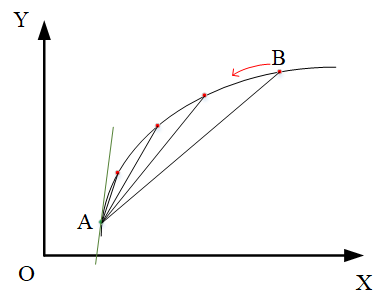
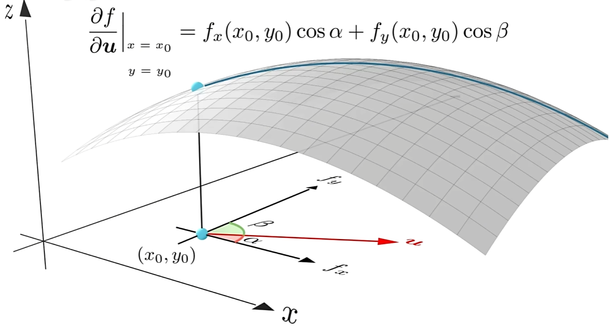
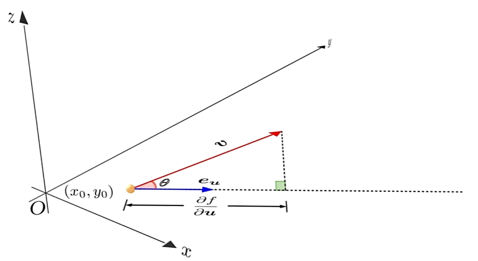
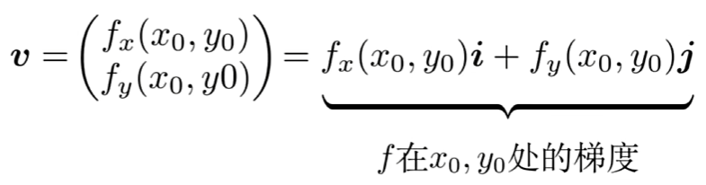
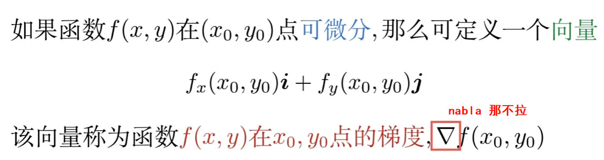
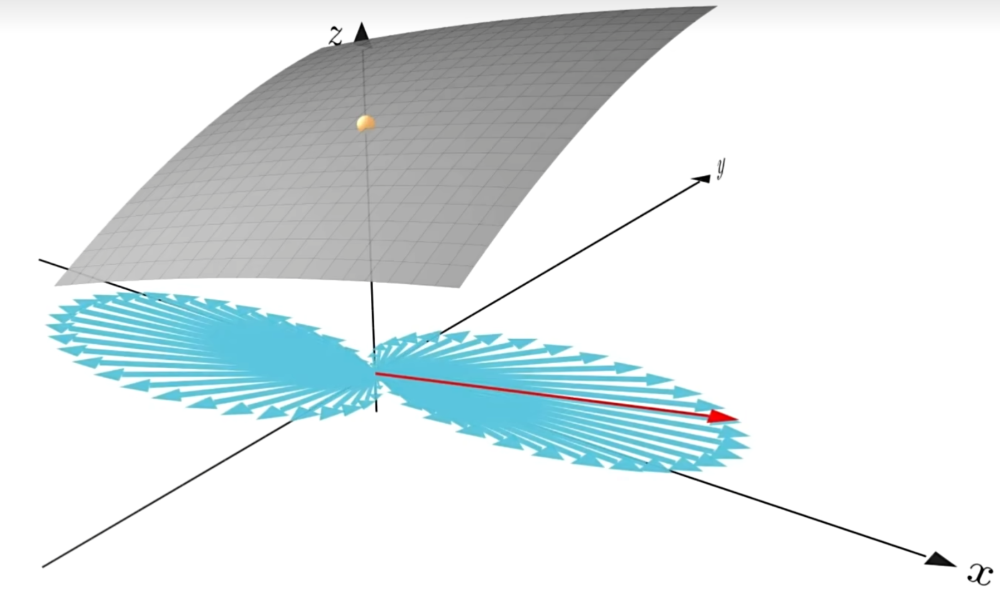
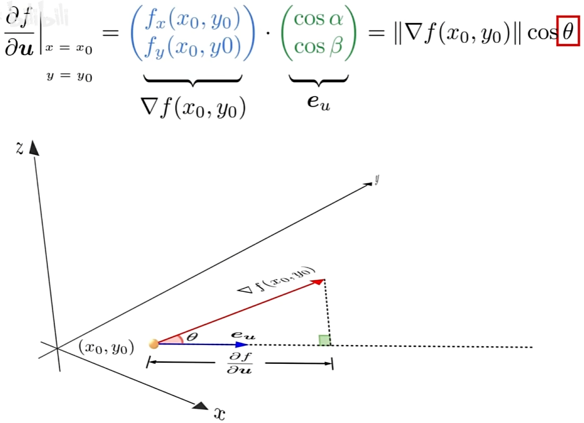
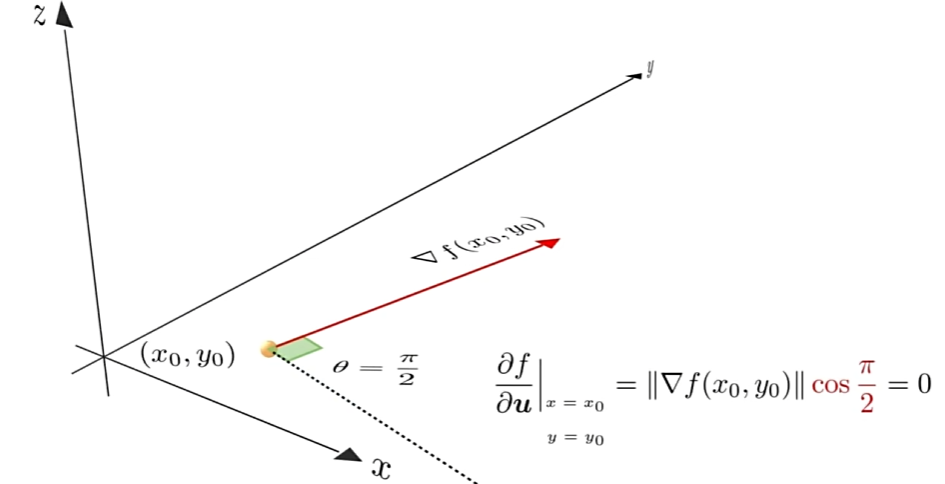

# 梯度

[如何理解梯度(方向导数的最大值)_哔哩哔哩](https://www.bilibili.com/video/BV16S421X78A/?spm_id_from=333.337.search-card.all.click&vd_source=4e1dceccc918063def66c9d643674c6a)

> 梯度<–方向导数<–偏导数<–导数

* 导数 对应一元(单变量)函数，表示一元函数在该点的变化率.
* 偏导数 对应多元(多变量)函数，表示多元函数在该点沿坐标轴方向的变化率.
* 方向导数 是偏导数概念的推广，表示多元函数在该点沿某一方向的变化率.
* 梯度 是特殊的方向导数，表示多元函数在该点沿该方向变化率最大(该方向为梯度的方向，变化率为梯度的

## 导数

**导数**对应一元(单变量)函数，表示一元函数**在该点**的变化率.

一元函数在坐标系中表示为曲线，其几何意义为函数在该点切线的斜率，其本质是通过极限的概念对函

数进行局部的线性逼近.

例如：计算曲线 f(x) 上A、B两点的斜率K，B无限趋近于A，即表示为

$$K=\frac{f(x_{A}+\Delta x)-f(x_{A})}{\Delta x} (\Delta x\rightarrow 0) $$

此时，K便表示曲线在A点处的斜率/变化率，亦称之为函数 f(x) 在该点处的导数

$$f^{'}(x_{A})=\lim_{\Delta x\rightarrow 0}\frac{f(x_{A}+\Delta x)-f(x_{A})}{\Delta x}$$

## 偏导数

**偏导数**对应多元(多变量)函数，表示多元函数**在该点沿坐标轴方向**的变化率.

图文描述时，一般以二元函数为例(更高元的函数也画不出来)，下图为二元函数 z = f ( x , y )

$\frac{\partial f}{\partial x}/f_x(x,y)$表示函数沿x轴方向的变化率(此时y视为常量)

$\frac{\partial f}{\partial y}/f_y(x,y)$表示函数沿y轴方向的变化率(此时x视为常量)

## 方向导数

**方向导数**是偏导数概念的推广，表示多元函数**在该点沿某一方向**的变化率

在可微分的情况下，方向导数可以被偏导数线性表示

假设求向量u方向上的方向导数，如下计算

将方向导数的公式用向量点积的形式改写

那么,这个式子就说明,方向导数是向量v在$e_u$上的投影

当theta不断靠近零时,向量v在$e_u$方向上的投影也在不断的扩大

**而当$e_u$与V同向时，所得投影获得最大值，这说明,向量v的模长，即为方向导数中的最大者**

向量v就是函数f在此点处的**梯度**

## 梯度

==梯度的值是方向导数中的最大值==

下图蓝色向量是某二元函数在（0，0）点处所有的方向导数，红色向量为梯度

反之，函数在U方向上的方向导数，等于梯度在其方向上的投影

当θ=$\frac{1}{2}\pi$时，方向导数为0

在多变量函数中，梯度是一个向量，向量有方向，梯度的方向就指出了函数在给定点的上升最快的方向
这也就说明了为什么我们需要千方百计的求取梯度！我们需要到达山底，就需要在每一步观测到此时最陡峭的地方，梯度就恰巧告诉了我们这个方向。**梯度的方向是函数在给定点上升最快的方向，那么梯度的反方向就是函数在给定点下降最快的方向，这正是我们所需要的。所以我们只要沿着梯度的方向一直走，就能走到局部的最低点**

跳过几个激活函数系数就能降低多少
