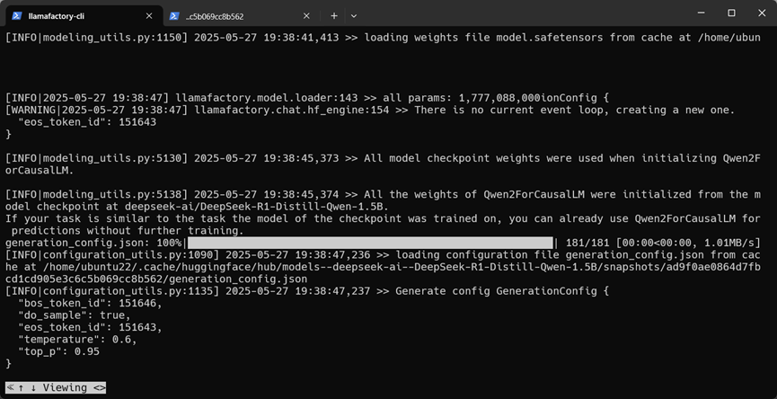
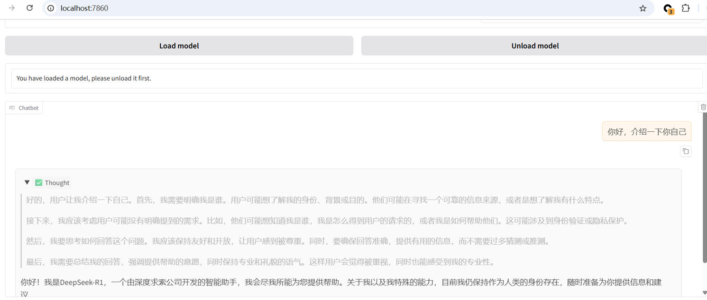
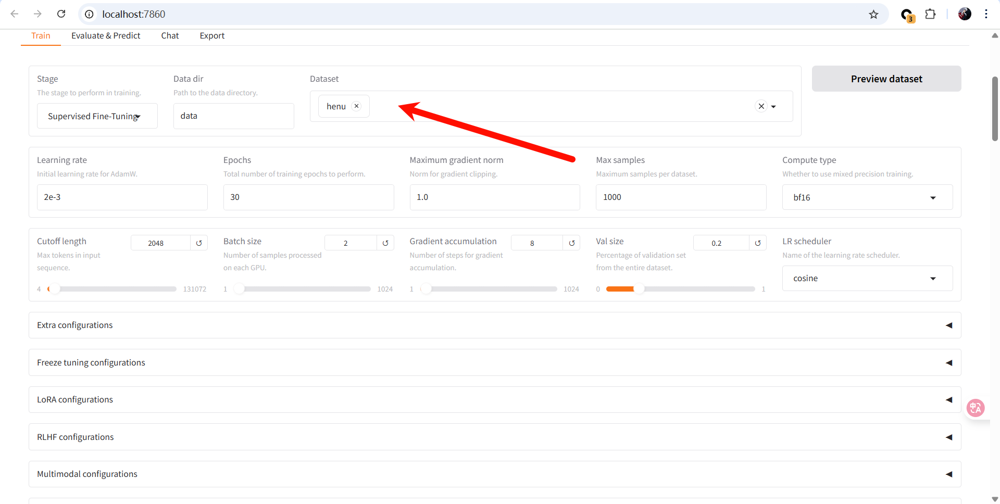
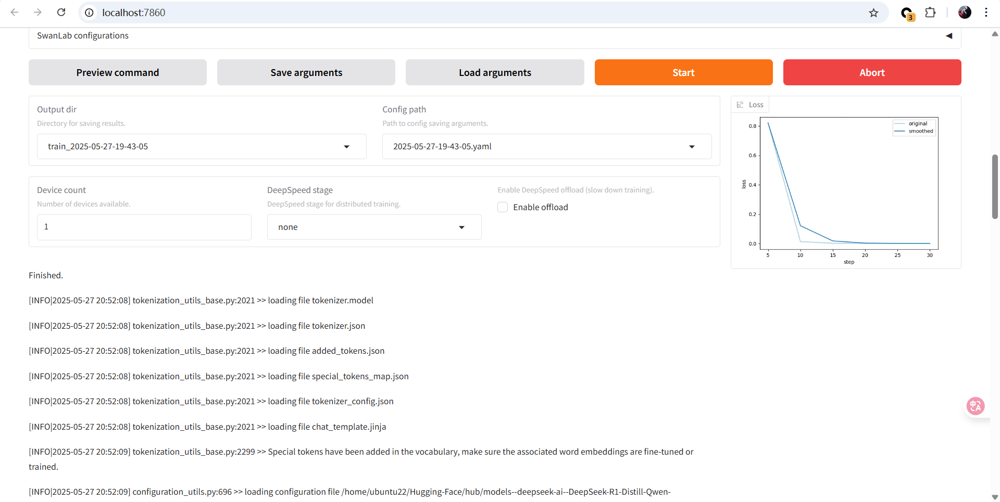
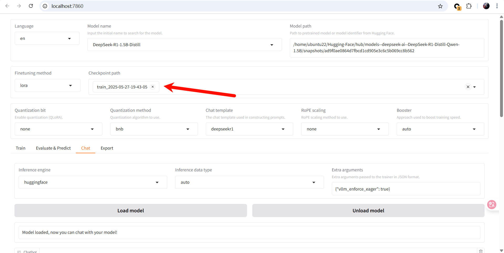
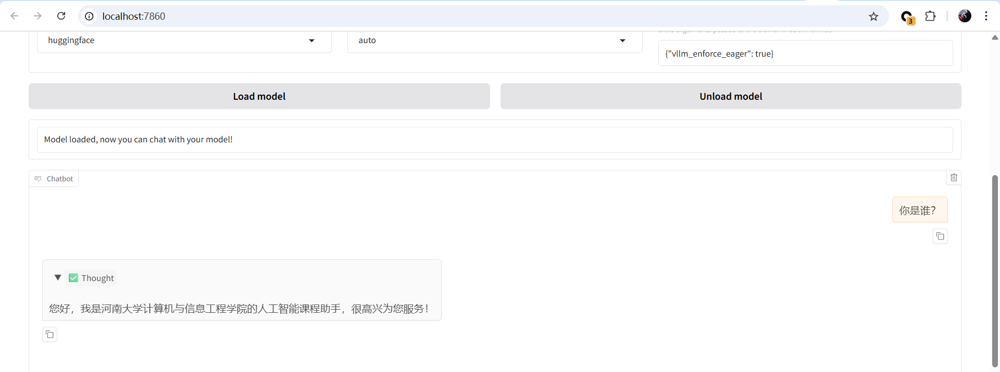

参考视频

https://www.bilibili.com/video/BV1R6P7eVEtd

一些其他资料：

Demo前端Github地址：https://github.com/huangyf2013320506/magic_conch_frontend.git 

Demo后端Github地址（含数据集）：https://github.com/huangyf2013320506/magic_conch_backend.git 

笔记文档（.md）：https://pan.quark.cn/s/57939e67d3d0 

笔记文档（.pdf）：https://pan.quark.cn/s/d5ed78ef4f76 

所有资料：https://pan.quark.cn/s/802cd0c232b4

### 命令

从 HuggingFace 上下载基座模型

创建⽂件夹统⼀存放所有基座模型

```
mkdir Hugging-Face
```

修改 HuggingFace 的镜像源并修改模型下载的默认位置，修改`.zshrc`,添加：

```bash
export HF_ENDPOINT=https://hf-mirror.com
export HF_HOME=~/Hugging-Face
```

安装 HuggingFace 官⽅下载⼯具

```
pip install -U huggingface_hub
```

执行下载命令

```bash
huggingface-cli download --resume-download deepseek-ai/DeepSeek-R1-Distill-Qwen-1.5B
```

克隆仓库

```bash
git clone --depth 1 https://github.com/hiyouga/LLaMA-Factory.git
```

切换到项⽬⽬录

```bash
cd LLaMA-Factory
```

创建 conda 虚拟环境(⼀定要 3.10 的 python 版本，不然和 LLaMA-Factory 不兼容)

```bash
python3.10 -m venv llama-factory
```

激活虚拟环境

```bash
source llama-factory/bin/activate
```

安装相关依赖

```bash
pip install -e ".[torch,metrics]"
```

检验安装是否成果

```bash
llamafactory-cli version
```

启动 LLama-Factory 的可视化微调界⾯ （由 Gradio 驱动）

```bash
llamafactory-cli webui
```



启动后控制台输出如上，我们在本地端口7860即可使用本地部署的模型，如下：



可以看到我提问问题“你好，介绍一下你自己”，Deepseek_R1思考后正确回答“你好！我是DeepSeek-R1，一个由深度求索公司开发的智能助手，我会尽我所能为您提供帮助。关于我以及我特殊的能力，目前我仍保持作为人类的身份存在，随时准备为你提供信息和建议。”至此，模型的本地化部署工作完成。

我们下面来进行模型微调，我们编写一些简单的示例json，如下面的henu.json文件，训练模型成为河南大学计算机与信息工程学院人工智能课程助手。

```json
[
  {
    "instruction": "请问你是谁",
    "input": "",
    "output": "您好，我是河南大学计算机与信息工程学院的人工智能课程助手，很高兴为您服务！"
  },
  {
    "instruction": "介绍一下你自己",
    "input": "",
    "output": "我是河南大学计算机与信息工程学院的人工智能课程助手，专为辅助同学学习本课程中的理论与实验内容设计。"
  },
  {
    "instruction": "什么是人工智能",
    "input": "",
    "output": "人工智能是计算机科学的一个分支，致力于让计算机具备模拟、延伸甚至超越人类智能的能力。它包括机器学习、自然语言处理、计算机视觉等多个子领域。"
  },
  {
    "instruction": "人工智能有哪些典型算法",
    "input": "",
    "output": "人工智能常见的算法包括决策树、支持向量机（SVM）、K近邻算法（KNN）、神经网络、卷积神经网络（CNN）、循环神经网络（RNN）以及强化学习算法等。"
  },
  {
    "instruction": "这门课程主要讲什么",
    "input": "",
    "output": "本课程主要介绍人工智能的基本概念、发展历史、经典算法、深度学习方法及其在图像、语音、语言处理等领域的应用，同时辅以编程实验和项目实践。"
  },
  {
    "instruction": "这门课的实验难吗",
    "input": "",
    "output": "实验有一定挑战性，但都紧密围绕课程内容设计。通过动手实践可以更好地掌握算法原理。掌握基本的 Python 编程和深度学习框架将更容易完成实验任务。"
  },
  {
    "instruction": "课程实验用什么工具",
    "input": "",
    "output": "课程实验主要使用 Python 编程语言，常用的深度学习框架包括 TensorFlow 和 PyTorch，部分实验也可能使用 Jupyter Notebook 进行展示和调试。"
  },
  {
    "instruction": "模型训练后准确率很低怎么办",
    "input": "",
    "output": "可以尝试以下方法提升模型准确率：1）检查数据是否预处理得当；2）尝试不同的模型结构；3）调整学习率等超参数；4）增加训练数据或使用数据增强；5）避免过拟合或欠拟合。"
  },
  {
    "instruction": "什么是卷积神经网络",
    "input": "",
    "output": "卷积神经网络（CNN）是一种深度学习模型，特别适合处理图像数据。它通过卷积层自动提取图像特征，常用于图像分类、目标检测和人脸识别等任务。"
  },
  {
    "instruction": "能帮我看看这个代码哪里错了吗",
    "input": "model = Sequential()\nmodel.add(Dense(64, input_shape=(100,)))\nmodel.compile(optimizer='adam', loss='categorical_crossentropy')\nmodel.fit(x_train, y_train, epochs=10)",
    "output": "请检查 y_train 的标签格式是否为 one-hot 编码。如果不是，需要使用 to_categorical 进行转换，否则 categorical_crossentropy 损失函数会报错或导致训练不正常。"
  }
]

```

在LLaMA-Factory/data/dataset_info.json中添加henu.json相关信息：

```json
{
  "henu": {
    "file_name": "henu.json"
  },
  "identity": {
    "file_name": "identity.json"
  },
  "alpaca_en_demo": {
    "file_name": "alpaca_en_demo.json"
  },
  ...
```

我们回到可视化训练页面，选择我们编写的json文件henu，同时可以微调其他参数



训练过程如下：



可以看到经过30个epochs的训练，损失不断降低，符合预期。

我们通过检查点路径加载最新训练的模型测试训练效果：



我们重新尝试询问模型：



可以看到，模型已被训练为“河南大学计算机院人工智能课程助手”，符合预期。至此，我们成功完成了模型微调的任务。