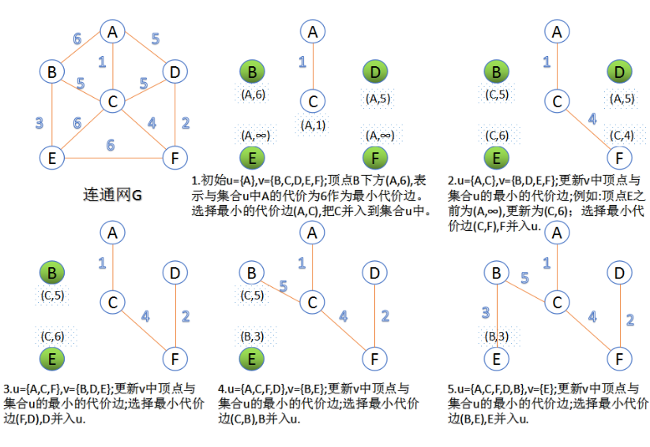
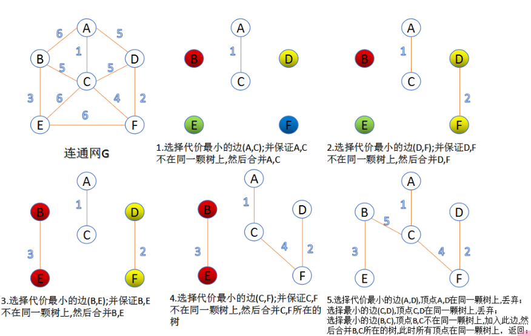

## Prim算法

### 介绍

此算法可以称为“加点法”，每次迭代选择代价最小的边对应的点，加入到最小生成树中。算法从某一个顶点s开始，逐渐长大覆盖整个连通网的所有顶点。

1. 图的所有顶点集合为$V$；初始令集合$u={s},v=V−u$
2. 在两个集合$u,v$能够组成的边中，选择一条代价最小的边($u_0$,$v_0$)，加入到最小生成树中，并把$v_0$并入到集合u中。
3. 重复上述步骤，直到最小生成树有n-1条边或者n个顶点为止。




由于不断向集合$u$中加点，所以最小代价边必须同步更新；需要建立一个辅助数组`closedge`,用来维护集合$v$中每个顶点与集合$u$中最小代价边信息。


```c
struct node 
{
    char data;				 // 距离最短的点信息
    unsigned int lowestcost; // 最短距离
} closedge[vexCounts]; //Prim算法中的辅助信息

// 完全等效于下面这种
struct node{
    char data;
    unsigned int lowestcost;
};
struct node closedge[vexCounts];

// 或者使用别名
typedef struct node{
    char data;
    unsigned int lowestcost;
} Node;
Node closedge[vexCounts];
```

### 代码

```
https://github.com/dingdingqiuqiu/test/tree/main
```

代码

```cpp
#include <iostream>
#define INF 0x7FFFFFFF   // 无穷大（不可达）
#define VEX_COUNT 6   // 顶点数量

char vertex[] = { 'A', 'B', 'C', 'D', 'E', 'F' }; // 顶点名称

// 邻接矩阵初始化（手动输入示例图的边权）
void initAdjMatrix(int adjMat[][VEX_COUNT]) {
    for (int i = 0; i < VEX_COUNT; i++)
        for (int j = 0; j < VEX_COUNT; j++)
            adjMat[i][j] = INF;

    // 填充实际边权（无向图对称赋值）
    adjMat[0][1] = 6; adjMat[0][2] = 1; adjMat[0][3] = 5;
    adjMat[1][0] = 6; adjMat[1][2] = 5; adjMat[1][4] = 3;
    adjMat[2][0] = 1; adjMat[2][1] = 5; adjMat[2][3] = 5; adjMat[2][4] = 6; adjMat[2][5] = 4;
    adjMat[3][0] = 5; adjMat[3][2] = 5; adjMat[3][5] = 2;
    adjMat[4][1] = 3; adjMat[4][2] = 6; adjMat[4][5] = 6;
    adjMat[5][2] = 4; adjMat[5][3] = 2; adjMat[5][4] = 6;
}

// Prim算法核心实现
void primMST(int adjMat[][VEX_COUNT], int start) {
    struct Node {
        int prev;     // 连接到生成树的哪个顶点
        int minCost;  // 到生成树的最小边权
    } closedge[VEX_COUNT]; // 关键结构：记录每个顶点的最小连接信息

    // 初始化所有顶点信息
    for (int i = 0; i < VEX_COUNT; i++) {
        closedge[i].minCost = INF;
        closedge[i].prev = -1;
    }
    closedge[start].minCost = 0; // 起点加入生成树

    // 初始化起点邻接边
    for (int i = 0; i < VEX_COUNT; i++) {
        if (i != start) {
            closedge[i].minCost = adjMat[start][i];
            closedge[i].prev = start;
        }
    }

    int totalCost = 0;

    // 主循环：每次加入一个新顶点
    for (int step = 0; step < VEX_COUNT - 1; step++) {
        // 选出当前最小边
        int minVal = INF, select = -1;
        for (int i = 0; i < VEX_COUNT; i++) {
            if (closedge[i].minCost != 0 && closedge[i].minCost < minVal) {
                minVal = closedge[i].minCost;
                select = i;
            }
        }

        // 输出选择的边
        if (select != -1) {
            std::cout << vertex[closedge[select].prev]
                      << " -> " << vertex[select]
                      << " (cost: " << minVal << ")\n";
            totalCost += minVal;
            closedge[select].minCost = 0; // 加入生成树
        }

        // 更新 closedge
        for (int neighbor = 0; neighbor < VEX_COUNT; neighbor++) {
            if (adjMat[select][neighbor] < closedge[neighbor].minCost) {
                closedge[neighbor].minCost = adjMat[select][neighbor];
                closedge[neighbor].prev = select;
            }
        }
    }

    std::cout << "Total Cost of MST: " << totalCost << "\n";
}

int main() {
    int adjMat[VEX_COUNT][VEX_COUNT];
    initAdjMatrix(adjMat);  // 初始化邻接矩阵

    std::cout << "Minimum Spanning Tree (Prim):\n";
    primMST(adjMat, 0); // 从顶点A（下标0）开始生成

    return 0;

}

```

队列优化

```cpp
#include <iostream>
#include <vector>
#include <queue>
#include <climits>
#define VEX_COUNT 6

using namespace std;

char vertex[] = { 'A', 'B', 'C', 'D', 'E', 'F' };

// 邻接表结构：更节省空间，适合稀疏图
vector<vector<pair<int, int>>> buildAdjList() {
    vector<vector<pair<int, int>>> adj(VEX_COUNT);
    // 填充边权（无向图）
    adj[0].push_back({1, 6}); adj[0].push_back({2, 1}); adj[0].push_back({3, 5});
    adj[1].push_back({0, 6}); adj[1].push_back({2, 5}); adj[1].push_back({4, 3});
    adj[2].push_back({0, 1}); adj[2].push_back({1, 5}); adj[2].push_back({3, 5});
    adj[2].push_back({4, 6}); adj[2].push_back({5, 4});
    adj[3].push_back({0, 5}); adj[3].push_back({2, 5}); adj[3].push_back({5, 2});
    adj[4].push_back({1, 3}); adj[4].push_back({2, 6}); adj[4].push_back({5, 6});
    adj[5].push_back({2, 4}); adj[5].push_back({3, 2}); adj[5].push_back({4, 6});
    return adj;
}

void primOptimal(vector<vector<pair<int, int>>>& adj, int start) {
    vector<int> key(VEX_COUNT, INT_MAX);  // key[i]表示顶点i到生成树的最小边权
    vector<int> parent(VEX_COUNT, -1);    // parent[i]记录顶点i在生成树中的父节点
    vector<bool> inMST(VEX_COUNT, false); // 标记顶点是否已加入生成树

    // 优先队列：存储格式为 (key值, 顶点索引)，最小堆优先取key最小的顶点
    priority_queue<pair<int, int>, vector<pair<int, int>>, greater<pair<int, int>>> pq;

    key[start] = 0;       // 起始点key设为0
    pq.push({0, start});  // 初始将起始点入队

    while (!pq.empty()) {
        int u = pq.top().second; // 取出当前key最小的顶点u
        pq.pop();

        if (inMST[u]) continue; // 已处理的顶点直接跳过
        inMST[u] = true;        // 标记u已加入生成树

        // 输出生成树的边（排除起始点）
        if (parent[u] != -1) {
            cout << vertex[parent[u]] << " -> " << vertex[u] 
                 << " (cost: " << key[u] << ")" << endl;
        }

        // 遍历u的所有邻接顶点v
        for (auto& edge : adj[u]) {
            int v = edge.first;
            int weight = edge.second;
            // 若v未在生成树中，且当前边权更小
            if (!inMST[v] && weight < key[v]) {
                key[v] = weight;     // 更新v的key值
                parent[v] = u;       // 设置v的父节点为u
                pq.push({key[v], v});// 将新key值入队（允许重复，旧值会被跳过）
            }
        }
    }
}

int main() {
    auto adj = buildAdjList(); // 构建邻接表
    cout << "Optimized Prim with Priority Queue:\n";
    primOptimal(adj, 0);      // 从A（下标0）开始
    return 0;
}

```


```c
#include <iostream>
#include <vector>
#include <queue>
#include <algorithm>
using namespace std;
#define INFINITE 0xFFFFFFFF   
#define VertexData unsigned int  //顶点数据
#define UINT  unsigned int
#define vexCounts 6  //顶点数量
char vextex[] = { 'A', 'B', 'C', 'D', 'E', 'F' };
struct node 
{
    VertexData data;
    unsigned int lowestcost;
}closedge[vexCounts]; //Prim算法中的辅助信息
typedef struct 
{
    VertexData u;
    VertexData v;
    unsigned int cost;  //边的代价
}Arc;  //原始图的边信息
void AdjMatrix(unsigned int adjMat[][vexCounts])  //邻接矩阵表示法
{
    for (int i = 0; i < vexCounts; i++)   //初始化邻接矩阵
        for (int j = 0; j < vexCounts; j++)
        {
            adjMat[i][j] = INFINITE;
        }
    adjMat[0][1] = 6; adjMat[0][2] = 1; adjMat[0][3] = 5;
    adjMat[1][0] = 6; adjMat[1][2] = 5; adjMat[1][4] = 3;
    adjMat[2][0] = 1; adjMat[2][1] = 5; adjMat[2][3] = 5; adjMat[2][4] = 6; adjMat[2][5] = 4;
    adjMat[3][0] = 5; adjMat[3][2] = 5; adjMat[3][5] = 2;
    adjMat[4][1] = 3; adjMat[4][2] = 6; adjMat[4][5] = 6;
    adjMat[5][2] = 4; adjMat[5][3] = 2; adjMat[5][4] = 6;
}
int Minmum(struct node * closedge)  //返回最小代价边
{
    unsigned int min = INFINITE;
    int index = -1;
    for (int i = 0; i < vexCounts;i++)
    {
        if (closedge[i].lowestcost < min && closedge[i].lowestcost !=0)
        {
            min = closedge[i].lowestcost;
            index = i;
        }
    }
    return index;
}
void MiniSpanTree_Prim(unsigned int adjMat[][vexCounts], VertexData s)
{
    for (int i = 0; i < vexCounts;i++)
    {
        closedge[i].lowestcost = INFINITE;
    }      
    closedge[s].data = s;      //从顶点s开始
    closedge[s].lowestcost = 0;
    for (int i = 0; i < vexCounts;i++)  //初始化辅助数组
    {
        if (i != s)
        {
            closedge[i].data = s;
            closedge[i].lowestcost = adjMat[s][i];
        }
    }
    for (int e = 1; e <= vexCounts -1; e++)  //n-1条边时退出
    {
        int k = Minmum(closedge);  //选择最小代价边
        cout << vextex[closedge[k].data] << "--" << vextex[k] << endl;//加入到最小生成树
        closedge[k].lowestcost = 0; //代价置为0
        for (int i = 0; i < vexCounts;i++)  //更新v中顶点最小代价边信息
        {
            if ( adjMat[k][i] < closedge[i].lowestcost)
            {
                closedge[i].data = k;
                closedge[i].lowestcost = adjMat[k][i];
            }
        }
    }
}
void ReadArc(unsigned int  adjMat[][vexCounts],vector<Arc> &vertexArc) //保存图的边代价信息
{
    Arc * temp = NULL;
    for (unsigned int i = 0; i < vexCounts;i++)
    {
        for (unsigned int j = 0; j < i; j++)
        {
            if (adjMat[i][j]!=INFINITE)
            {
                temp = new Arc;
                temp->u = i;
                temp->v = j;
                temp->cost = adjMat[i][j];
                vertexArc.push_back(*temp);
            }
        }
    }
}
bool compare(Arc  A, Arc  B)
{
    return A.cost < B.cost ? true : false;
}
bool FindTree(VertexData u, VertexData v,vector<vector<VertexData> > &Tree)
{
    unsigned int index_u = INFINITE;
    unsigned int index_v = INFINITE;
    for (unsigned int i = 0; i < Tree.size();i++)  //检查u,v分别属于哪颗树
    {
        if (find(Tree[i].begin(), Tree[i].end(), u) != Tree[i].end())
            index_u = i;
        if (find(Tree[i].begin(), Tree[i].end(), v) != Tree[i].end())
            index_v = i;
    }

    if (index_u != index_v)   //u,v不在一颗树上，合并两颗树
    {
        for (unsigned int i = 0; i < Tree[index_v].size();i++)
        {
            Tree[index_u].push_back(Tree[index_v][i]);
        }
        Tree[index_v].clear();
        return true;
    }
    return false;
}
void MiniSpanTree_Kruskal(unsigned int adjMat[][vexCounts])
{
    vector<Arc> vertexArc;
    ReadArc(adjMat, vertexArc);//读取边信息
    sort(vertexArc.begin(), vertexArc.end(), compare);//边按从小到大排序
    vector<vector<VertexData> > Tree(vexCounts); //6棵独立树
    for (unsigned int i = 0; i < vexCounts; i++)
    {
        Tree[i].push_back(i);  //初始化6棵独立树的信息
    }
    for (unsigned int i = 0; i < vertexArc.size(); i++)//依次从小到大取最小代价边
    {
        VertexData u = vertexArc[i].u;  
        VertexData v = vertexArc[i].v;
        if (FindTree(u, v, Tree))//检查此边的两个顶点是否在一颗树内
        {
            cout << vextex[u] << "---" << vextex[v] << endl;//把此边加入到最小生成树中
        }   
    }
}

int main()
{
    unsigned int  adjMat[vexCounts][vexCounts] = { 0 };
    AdjMatrix(adjMat);   //邻接矩阵
    cout << "Prim :" << endl;
    MiniSpanTree_Prim(adjMat,0); //Prim算法，从顶点0开始.
    cout << "-------------" << endl << "Kruskal:" << endl;
    MiniSpanTree_Kruskal(adjMat);//Kruskal算法
    return 0;
}
```


## Kruskal算法

### 介绍

此算法可以称为“加边法”，初始最小生成树边数为0，每迭代一次就选择一条满足条件的最小代价边，加入到最小生成树的边集合里。

1. 把图中的所有边按代价从小到大排序；
2. 把图中的n个顶点看成独立的n棵树组成的森林；
3. 按权值从小到大选择边，所选的边连接的两个顶点$u_i$和$v_i$应属于两颗不同的树，则成为最小生成树的一条边，并将这两颗树合并作为一颗树。
4. 重复(3),直到所有顶点都在一颗树内或者有n-1条边为止。



### 代码

