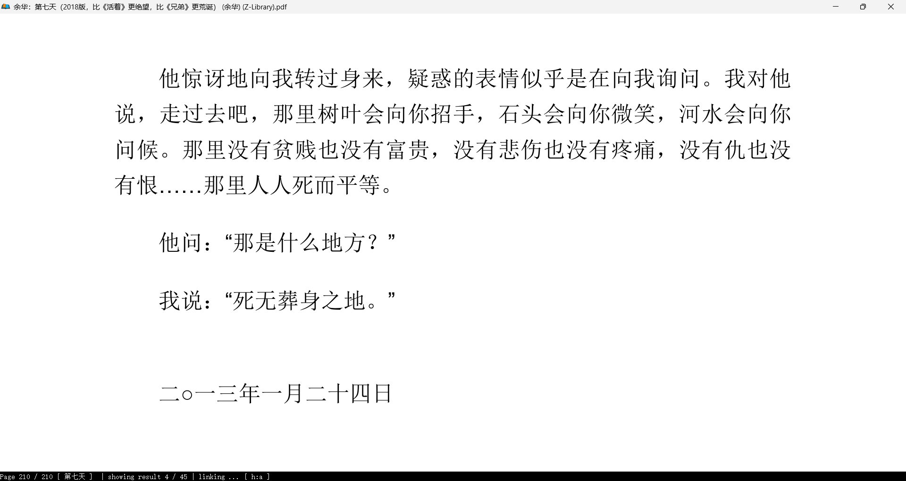

## 10.1

**算法：**

1. 跟着代码随想录，复习了一下1.1数组理论基础
2. 过程中遇到了STL中vector和array实现的相关问题，学习了STL的使用
3. 学习了模板和迭代器等技术，粗读了STL源码，了解了其实现思想

总结：

效率说实话挺高的，但字面学习效果好像不是很足，八股，项目都还没开，要继续努力啊xd

看了一下内容，说实话真该继续努力了，一天3道算法题就好了。算法我感觉至少得俩月学完吧，不然真找不到实习了，时间真挺紧张的。

八股和项目也得找时间做一做了，加油加油。

一天一道算法题要6个月+，说实话真有点慢了。

> Tips:突然发现只有写二级标题才会有导航页，看来要多写二级标题了哈

## 10.2

什么也没有干，主要是回到了永城，收拾了一下屋子

明天给屋里装光猫，买了路由器，不知道什么时候到，睡觉了。

## 10.3

早上因为乌龙给我ax3000路由器退了，因为家里说可以免费换光猫和路由器

今天给屋里装了光猫 出去吃了饭 地锅鸡 味道有点淡

发现腾达ac2100路由器有点断流

买了中兴ax3000路由器 126.8 不知道效果怎么样 期待

不知道什么时候可以到

## 10.4

连续的下雨 想开追凡人修仙传了 摆一天

## 10.5

今天周六 本来计划去看俺外爷 结果因为睡觉没去成 

事实证明 后面也天天睡觉没去成 直到下周日才去成

## 10.6

依旧下雨 依旧睡大觉 依旧凡人修仙传

## 10.19

以上时间 把马里奥惊奇通关了 其他乱七八糟的游戏也都玩了玩

动漫凡人修仙传看到了韩立结婴  很不错的动漫 一天十集看了10多天 看爽了 164集

因为频繁使用vivo y52s备用机 其于10.15损坏 非常伤心 终究还是没能等到iq15发售

前两天去线下看了iq15 屏幕非常不错 白色传奇版很心动 凌云因为没货 没看到 后面凌云越看越腻 决定传奇版16+512 

网传价格5099 希望朋友那里的渠道价可以便宜一些 明天晚上19点的发布会 期待

至于网络方面 订的中兴AX3000巡天版确实很不错 因为小户型关了2.4G频段(传播远 信号差)，关了ipv6，了解了下Mesh组网 确实很不错 不过我这很小 确实没啥必要了 网络方面除了有一次因为电脑本身网卡问题 速度骤降至10Mb以下 电脑重启后恢复千兆的速度(这里师傅来检查 还落下一根六类线 很爽了也是)

至于今天 去体育广场跑了一圈 体重目前84kg 有点夸张了现在 头发还少 

真成门酱了（） 准备没啥事跑跑步啥的 明天因为发布会 训练计划改成室内

计划如果真没啥事 训练计划都可以室内进行哈 不要因为天气当懒狗哈

> 总之这几天确实没干啥实事 睡觉也是保持在4点睡 12点起 十分恶心了也是 臭肥宅
>
> 重启了日记计划 希望多少可以做出点改变
>
> 今天试下22点-23点睡觉 每天21点30后写写日记准备睡觉了 
>
> 感觉写写日记确实对总结生活和计划未来方面有点用哈 睡觉了 晚安

## 10.20

昨天看余华第七天到凌晨两点

今天12点才醒  可惜iqoo15要过几天才能拿到了 很伤心 玩电脑到下午五点钟

## 后续

后面手机到了就去旅游了 纯玩了一个月 旅游了很多城市，农两天搞到了荣耀青莲剑仙称号。

11月中旬才回开封 这篇当美好回忆回忆录写 如下：

