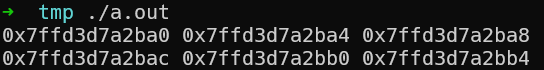
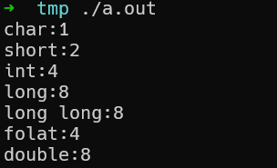
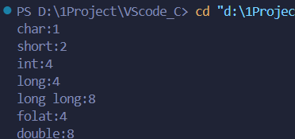
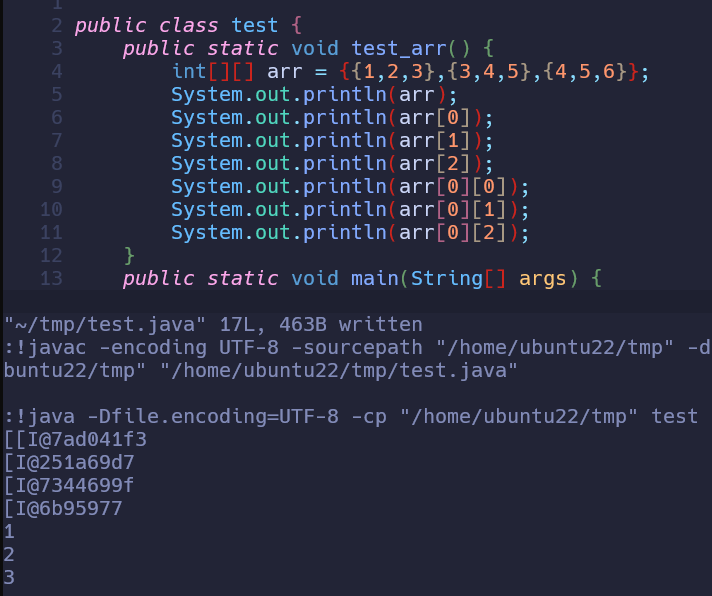
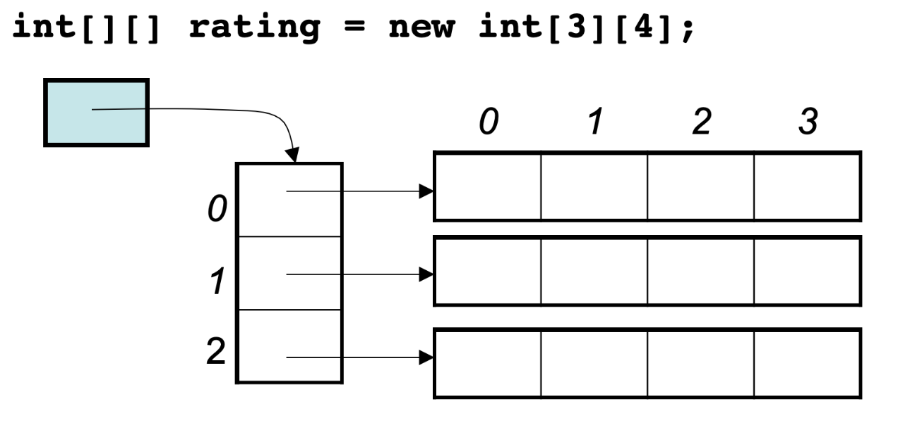

# C/C++

## 内存空间连续性

数组空间连续，对于二维数组来说亦是

```c
void test_arr() {
    int array[2][3] = {
		{0, 1, 2},
		{3, 4, 5}
    };
    cout << &array[0][0] << " " << &array[0][1] << " " << &array[0][2] << endl;
    cout << &array[1][0] << " " << &array[1][1] << " " << &array[1][2] << endl;
}

int main() {
    test_arr();
}
```



可以看到每个int占据4字节，且地址空间连续，另外补充各个数据类型大小

```c
void test_size() {
    cout << "char:" << sizeof(char) << endl;
    cout << "short:" << sizeof(short) << endl;
    cout << "int:"  << sizeof(int) << endl;
    cout << "long:" << sizeof(long) << endl;
    cout << "long long:"  << sizeof(long long) << endl;
    cout << "folat:"<< sizeof(float) << endl;
    cout << "double:"<< sizeof(double) << endl;
}
```



实际运行情况根据平台不同而不同，例如long 在32位机上4字节，在64位Linux机上8字节，在64位Windows上仍是4字节



## vector和array实现底层机制

> 这块底层机制可以去看1.1-1STL源码部分的讲解

**核心思想：**

- **`int[]`**：C++内置的**原始数组**，固定大小，性能最高但功能最少
- **`array`**：STL中的**封装数组**，固定大小，提供迭代器、size()等便利方法
- **`vector`**：STL中的**动态数组容器**，底层用数组实现，但能自动扩容缩容

**核心纠正：**

1. **vector和array都是模板容器**：

   ```cpp
   template<typename T, size_t N> class array;    // 固定大小容器
   template<typename T> class vector;            // 动态大小容器
   ```
   两者都是模板类，都是STL容器

2. **正确的层次关系**：

   ```txt
   原始数组 (int[]/T[]) - C++内置类型
       ↗️                  ↖️
   array<T,N>          vector<T>
   (固定大小容器)        (动态大小容器)
   ```

**精炼总结**：

- **array和vector都是STL容器模板**
- array封装固定数组，vector封装动态数组
- 区别在于：**固定大小 vs 动态大小**，而不是容器vs非容器

**一句话**：array和vector都是容器模板，一个固定大小，一个动态大小。

# Java

## 内存空间非连续性

像Java是没有指针的，同时也不对程序员暴露其元素的地址，寻址操作完全交给虚拟机。

所以看不到每个元素的地址情况，这里我以Java为例，也做一个实验。

```java
import java.util.*;

public class test {
    public static void test_arr() {
        int[][] arr = {{1,2,3},{3,4,5},{4,5,6}};
        System.out.println(arr);
        System.out.println(arr[0]);
        System.out.println(arr[1]);
        System.out.println(arr[2]);
        System.out.println(arr[0][0]);
        System.out.println(arr[0][1]);
        System.out.println(arr[0][2]);
    }
    public static void main(String[] args) {
        test_arr();
    }
}
```



这里的数值也是16进制，这不是真正的地址，而是经过处理过后的数值了，我们也可以看出，二维数组的每一行头结点的地址是没有规则的，更谈不上连续。

所以Java的二维数组可能是如下排列的方式：

