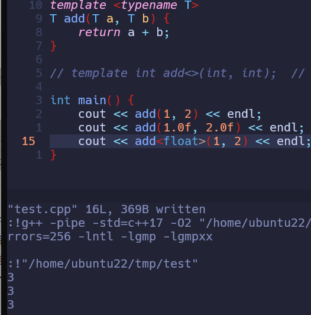
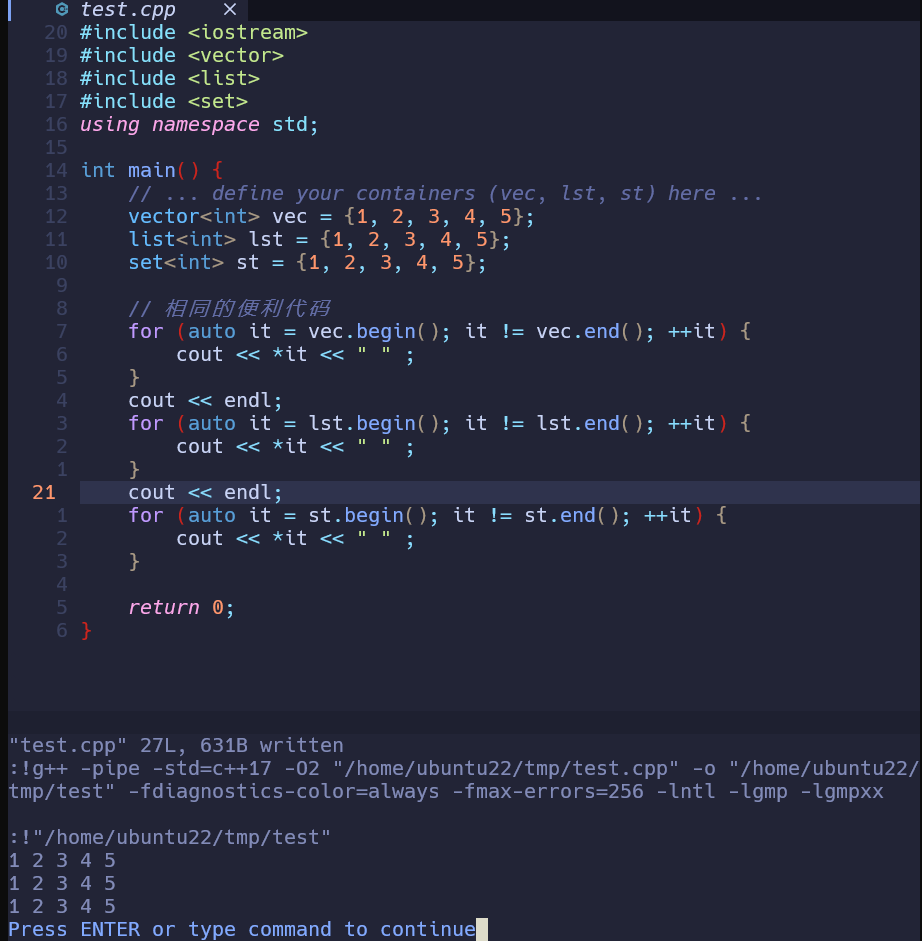

## **泛型 (Generic)** 编程-函数重载、宏与模板

> 就是为不同的类型编写相同的代码，实现代码复用。
>
> 这里STL主要用到的就是模板，这也是STL容器实现的基础

- 函数重载

```cpp
int add(int a, int b) { return a + b; }
float add(float a, float b) { return a + b; }
double add(double a, double b) { return a + b; }
// 需要为每种类型写一遍！也是非常麻烦哈
```

- 宏

> 实际上进行的工作是换名

```
#define 宏名称 替换文本
```

eg

```cpp
#define add(T) _ADD_IMPL_##T

#define ADD_IMPL(T)        \
    T add(T)(T a, T b) {   \
        return a + b;      \
    }

ADD_IMPL(int);
ADD_IMPL(float);

int main() {
    add(int)(1, 2);
    add(float)(1.0f, 2.0f);
}
```

可展开为

```cpp
// 宏展开后的实际代码
int _ADD_IMPL_int(int a, int b) {
    return a + b;
}

float _ADD_IMPL_float(float a, float b) {
    return a + b;
}

int main() {
    _ADD_IMPL_int(1, 2);
    _ADD_IMPL_float(1.0f, 2.0f);
}
```

- 模板

```cpp
template <typename T>
T add(T a, T b) {
    return a + b;
}

template int add<>(int, int);  // explicit instantiation

int main() {
    add(1, 2);         // auto deduce T
    add(1.0f, 2.0f);   // implicit instantiation
    add<float>(1, 2);  // explicitly specify T
}
```



也是非常现代，非常完美哈。

## 迭代器

> **迭代器就像是容器世界的"通用遥控器"**，不管你是电视、空调还是音响（不同的容器），我都能用同一个遥控器（迭代器接口）来操作！

先从传统的数组遍历来

```cpp
int arr[5] = {1, 2, 3, 4, 5};

for (int* ptr = arr; ptr != arr + 5; ptr++) {
    cout << *ptr << " ";
}
```

这里的 `ptr` 其实就是一个**原始迭代器**！它知道如何移动到下一个元素，也知道何时停止。

而对于STL中的迭代器，更是**为所有容器提供了统一的操作接口**。例如以下代码：

```cpp
#include <iostream>
#include <vector>
#include <list>
#include <set>
using namespace std;

int main() { 
    // ... define your containers (vec, lst, st) here ...
    vector<int> vec = {1, 2, 3, 4, 5};
    list<int> lst = {1, 2, 3, 4, 5};
    set<int> st = {1, 2, 3, 4, 5};

    // 相同的遍历代码
    for (auto it = vec.begin(); it != vec.end(); ++it) {
        cout << *it << " " ;
    }
    cout << endl;
    for (auto it = lst.begin(); it != lst.end(); ++it) {
        cout << *it << " " ;
    }
    cout << endl;
    for (auto it = st.begin(); it != st.end(); ++it) {
        cout << *it << " " ;
    }

    return 0;
}
```



## 实现原理

STL其主要核心思想还是利用模板和迭代器实现类似"容器"的功能，其算法思想和传统数组并无不同，用于实现的技术和手段不同罢了

> AI的补充：STL通过模板实现泛型编程，通过迭代器将算法和容器解耦，从而提供一组高度可复用、高效且通用的组件。
>
> 因此，你的理解是合理的，但可能低估了STL设计的抽象程度和通用性。STL不仅仅是实现了容器，更重要的是它提供了一种编程范式，使得算法和容器可以独立发展，并通过迭代器相互协作。这种设计大大提高了代码的复用性和可维护性。

具体的实现细节可以看以下文章：

[github STL源码分析](https://github.com/CofeCore/STL?tab=readme-ov-file)

[知乎手撕 STL 序列式容器源码](https://zhuanlan.zhihu.com/p/359213877)

[知乎手撕 STL 空间配置器源码](https://zhuanlan.zhihu.com/p/331809729)