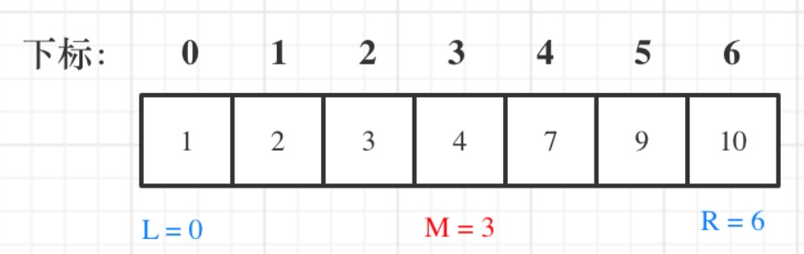

# 704.二分查找

## 704.二分查找-问题描述

[力扣题目链接(opens new window)](https://leetcode.cn/problems/binary-search/) 704

给定一个 n 个元素有序的（升序）整型数组 nums 和一个目标值 target  ，写一个函数搜索 nums 中的 target，如果目标值存在返回下标，否则返回 -1。

你必须编写一个具有 `O(log n)` 时间复杂度的算法。

示例 1:

```text
输入: nums = [-1,0,3,5,9,12], target = 9     
输出: 4       
解释: 9 出现在 nums 中并且下标为 4     
```

示例 2:

```text
输入: nums = [-1,0,3,5,9,12], target = 2     
输出: -1        
解释: 2 不存在 nums 中因此返回 -1        
```

提示：

- 你可以假设 nums 中的所有元素是不重复的。
- n 将在 [1, 10000]之间。
- nums 的每个元素都将在 [-9999, 9999]之间。

## 算法思路

0.关注区间范围 定义有效区间 我这习惯 左闭右闭即[left, right]。这也就决定了循环有效的条件是`left <= right `

1.关注完全可相信且**最小**的区间，故而移动`left`和`right`时，需要赋值`mid+1`和`mid-1`,详见2的图解

> 因为mid+1和mid-1的偏移 也造成了相等时的循环退出条件

2.实际判断`num[mid]`与`target`大小时 可以画个图 运行模拟下



例如`target`为2时,改变`right`为`mid` ;而`target`为9时，改变`left`为`mid`

3.实际写代码时，可以试着写出来能写出来的代码，再对代码修改排序（列公式再排序）

## 实际求解

```cpp
class Solution {
public:
    int search(vector<int>& nums, int target) {
        int left = 0; int right = nums.size() - 1;
        while (left <= right) {
            int mid = left + ((right - left) >> 1);
            if (nums[mid] > target) {
                right = mid - 1;
            } else if (nums[mid] < target) {
                left = mid + 1;
            } else {
                return mid;
            }
        }
        return -1; 
    }
};
```

```java
class Solution {
    public int search(int[] nums, int target) {
       int left = 0; int right = nums.length - 1;
       while (right >= left) {
           int mid = left + (right - left) / 2;
           if (nums[mid] == target) {
               return mid;
           } else if (nums[mid] < target) {
               left = mid + 1;
           } else {
               right = mid - 1;
           }
       }
        return -1;
    }
}
```

