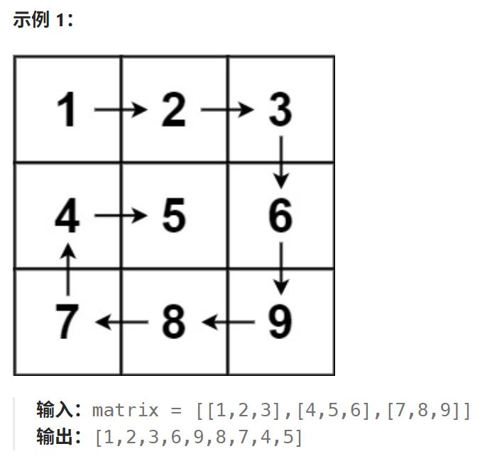
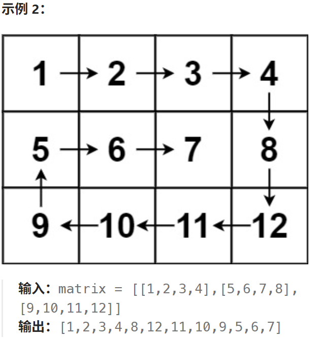

# 54.螺旋矩阵

## 54.螺旋矩阵

[力扣题目链接](https://leetcode.cn/problems/spiral-matrix/)

给你一个 `m` 行 `n` 列的矩阵 `matrix` ，请按照 **顺时针螺旋顺序** ，返回矩阵中的所有元素。





**提示：**

- `m == matrix.length`
- `n == matrix[i].length`
- `1 <= m, n <= 10`
- `-100 <= matrix[i][j] <= 100`

## 算法思路

可以将矩阵看成若干层，首先输出最外层的元素，其次输出次外层的元素，直到输出最内层的元素。

定义矩阵的第 k 层是到最近边界距离为 k 的所有顶点。例如，下图矩阵最外层元素都是第 1 层，次外层元素都是第 2 层，剩下的元素都是第 3 层。

**我们优先处理外围成圈的元素，中间的部分单独处理，分有中间部分，无中间部分的情况**

```
[[1, 1, 1, 1, 1, 1, 1],
 [1, 2, 2, 2, 2, 2, 1],
 [1, 2, 3, 3, 3, 2, 1],
 [1, 2, 2, 2, 2, 2, 1],
 [1, 1, 1, 1, 1, 1, 1]]
```

外围的圈想要写好关键是定义好遍历时每一轮循环的路径两端的开闭条件，这里统一采用左闭右开。


中间非圈部分不存在时满足`top>bottom||left>right`，这种情况我们不处理

> 所以我们下面用if ..... else if ......
>
> 而不是if ...... else .......

一旦`top==bottom||left==right `,说明中间部分存在，有一竖列或者一横列，我们根据情况单独处理

### 实现

```java
class Solution {
    public List<Integer> spiralOrder(int[][] matrix) {
        List<Integer> order = new ArrayList<Integer>();
        if (matrix == null || matrix.length == 0 || matrix[0].length == 0) {
            return order;
        }
        int rows = matrix.length, columns = matrix[0].length;
        int left = 0, right = columns - 1, top = 0, bottom = rows - 1;
        int column = 0; int row = 0;
        // 先围成圈外层
        while (left < right && top < bottom) {
            for (column = left; column < right; column++) {
                order.add(matrix[top][column]);
            }
            for (row = top; row < bottom; row++) {
                order.add(matrix[row][right]);
            }
            for (column = right; column > left; column--) {
                order.add(matrix[bottom][column]);
            }
            for (row = bottom; row > top; row--) {
                order.add(matrix[row][left]);
            }
            left++;
            right--;
            top++;
            bottom--;
        }
        // 单独处理中间有空缺的情况
        // left > right || top < right中间没空缺不必处理
        // left == right || top == bottom均为有空缺
        // [[1,2,3,4,5,6,7,8,9,10],[11,12,13,14,15,16,17,18,19,20]]
        if(left == right) {
            for (row = top; row <= bottom; row++) {
                order.add(matrix[row][right]);
            }
        } else if(top == bottom){
            for (column = left; column <= right; column++) {
                order.add(matrix[top][column]);
            }
        } 
        return order;
    }
}
```

