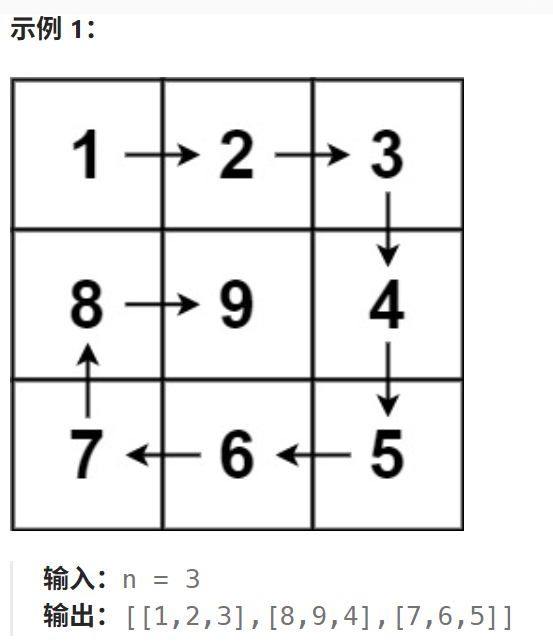

# 59.螺旋矩阵2

## 59.螺旋矩阵2

[力扣题目链接](https://leetcode.cn/problems/spiral-matrix-ii/description/)

给你一个正整数 `n` ，生成一个包含 `1` 到 `n2` 所有元素，且元素按顺时针顺序螺旋排列的 `n x n` 正方形矩阵 `matrix` 。



**提示：**

- `1 <= n <= 20`

## 算法思路

核心思路依旧是将矩阵看成若干层，首先输出最外层的元素，其次输出次外层的元素，直到输出最内层的元素。

**我们优先处理外围成圈的元素，中间的部分单独处理，分有中间部分，无中间部分的情况**

> 该例子更为简单，n%2==0无中间部分，否则有一个中间部分，单独赋值即可

```
[[1, 1, 1, 1, 1],
 [1, 2, 2, 2, 1],
 [1, 2, 3, 2, 1],
 [1, 2, 2, 2, 1],
 [1, 1, 1, 1, 1]]
```

外围的圈想要写好关键是定义好遍历时每一轮循环的路径两端的开闭条件，这里统一采用左闭右开。

> 以上思路同螺旋矩阵1


### 实现

```java
class Solution {
    public List<Integer> spiralOrder(int[][] matrix) {
        List<Integer> order = new ArrayList<Integer>();
        if (matrix == null || matrix.length == 0 || matrix[0].length == 0) {
            return order;
        }
        int rows = matrix.length, columns = matrix[0].length;
        int left = 0, right = columns - 1, top = 0, bottom = rows - 1;
        int column = 0; int row = 0;
        // 先围成圈外层
        while (left < right && top < bottom) {
            for (column = left; column < right; column++) {
                order.add(matrix[top][column]);
            }
            for (row = top; row < bottom; row++) {
                order.add(matrix[row][right]);
            }
            for (column = right; column > left; column--) {
                order.add(matrix[bottom][column]);
            }
            for (row = bottom; row > top; row--) {
                order.add(matrix[row][left]);
            }
            left++;
            right--;
            top++;
            bottom--;
        }
        // 单独处理中间有空缺的情况
        // left > right || top < right中间没空缺不必处理
        // left == right || top == bottom均为有空缺
        // [[1,2,3,4,5,6,7,8,9,10],[11,12,13,14,15,16,17,18,19,20]]
        if(left == right) {
            for (row = top; row <= bottom; row++) {
                order.add(matrix[row][right]);
            }
        } else if(top == bottom){
            for (column = left; column <= right; column++) {
                order.add(matrix[top][column]);
            }
        } 
        return order;
    }
}
```

