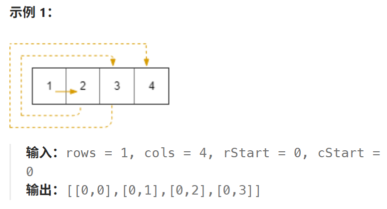
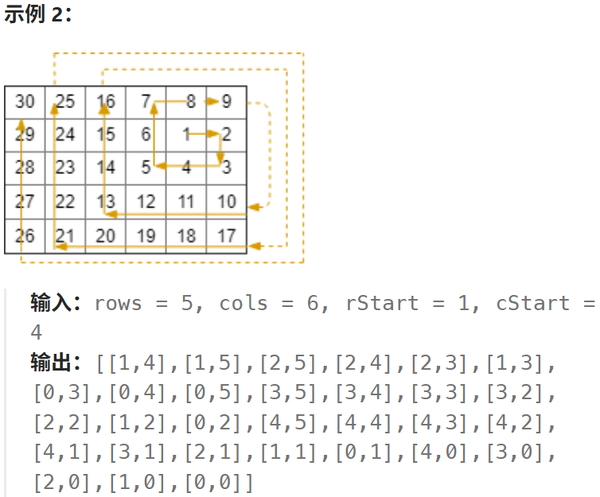

# 885.螺旋矩阵3

## 885.螺旋矩阵3

[力扣题目链接](https://leetcode.cn/problems/spiral-matrix-iii/description/)

在 `rows x cols` 的网格上，你从单元格 `(rStart, cStart)` 面朝东面开始。网格的西北角位于第一行第一列，网格的东南角位于最后一行最后一列。

你需要以顺时针按螺旋状行走，访问此网格中的每个位置。每当移动到网格的边界之外时，需要继续在网格之外行走（但稍后可能会返回到网格边界）。

最终，我们到过网格的所有 `rows x cols` 个空间。

按照访问顺序返回表示网格位置的坐标列表。





**提示：**

- `1 <= rows, cols <= 100`
- `0 <= rStart < rows`
- `0 <= cStart < cols`

## 算法思路

**1.层状自相似结构**

我们这里寻找类似螺旋矩阵1和螺旋矩阵2中的“自相似”操作

> 螺旋矩阵1和螺旋矩阵2中的自相似操作可以拆解为对矩阵每一层元素的处理
>
> 如下：

```
[[1, 1, 1, 1, 1],
 [1, 2, 2, 2, 1],
 [1, 2, 3, 2, 1],
 [1, 2, 2, 2, 1],
 [1, 1, 1, 1, 1]]
```

螺旋矩阵3中的“自相似操作”却类似如下：

```
[[3, 3, 3, 3, 3],
 [2, 2, 2, 2, 2],
 [2, 1, 1, 1, 2],
 [2, 1, 1, 1, 2],
 [2, 2, 2, 2, 2]]
```

我们依旧可以看出类似的“层状自相似机构”，不过每一层的起始位置变成了`top,left+1`,其行为走向为依旧为”右，下，左，上“，由于起始位置是`top,left+1`，我们在每一个方向的移动只能采取**左开右闭**

大循环结束的条件是**有效遍历数==row*cols的空间**

**2.转弯自相似结构** 

另外，其自相似操作还可以更细致地抽象为转弯后移动，移动方向为右下左上，如下：

```
[[7, 8, 8, 8, 8],
 [7, 3, 4, 4, 4],
 [7, 3, 0, 0, 5],
 [7, 2, 2, 1, 5],
 [6, 6, 6, 6, 5]]
```

其中一个小的**自相似循环**为0123部分，注意到此时的**边界值**和**层状自相似结构的边界值**不同，其中

```java
top = c0 - 1; // 注意这里是c0-1
```

具体写法是定义移动方向实际操作数组

```java
int[][] around = {{0, 1}, {1, 0}, {0, -1}, {-1, 0}};
```

 横纵坐标的移动为

 ```java
 row += around[dir][0];   //下一个节点
 col += around[dir][1];
 ```

移动方向定位初始定位为int型变量，0为右，1为下，2为左，3为上

 ```java
 dir = 0;  //其中dir按照0->1->2->3->0->1->2->3->0...方式循环
 ```

每次走到转弯的地方时更新方向转弯处边界值即可，例如

```java
 if (dir == 0 && col == right) {
     dir++;
     right++;
}
```

大循环结束的条件依旧是**有效遍历数==row*cols的空间**

**3.数学规律自相似**

通过以下矩阵

```
[[7, 8, 8, 8, 8],
 [7, 3, 4, 4, 4],
 [7, 3, 0, 0, 5],
 [7, 2, 2, 1, 5],
 [6, 6, 6, 6, 5]]
```

可以观察到移动的规律为从起点出发

```
右1->下1->左2->上2->右3->下3->左4->上4->右5
```

每次自相似结构可以抽象为

```java
右1->下1->左2->上2
```

先考虑大循环的执行次数

具体编程实现上，由于每个方向移动的距离不同，我们引入新变量`mov`，通过以下方法完成操作

```java
int mov = offset + dir/2;    
```

注意该方法也是**大循环里小循环非固定值的解决方法，引入额外变量控制小循环**,具体循环控制代码如下：

```java
int offset = 1; // [1 1 2 2][3 3 4 4] 第一个自相似偏移为1，第二个为3
while (num < R * C) {
    // 四个方向
    for(dir = 0; dir < 4;dir++) {
        // 两种移动距离
        int mov = offset + dir/2;
        for (int i = 0; i < mov; i++) {
            // 走一步
            row += around[dir][0];
            col += around[dir][1];
            // 看一步
            if (row >= 0 && row < R && col >= 0 && col < C) {
                res[num++] = new int[]{row, col};
            }
        }
    }
    offset += 2;
}
```

**4.两次转弯自相似**

由于每两次的运动位移一致，我们可以将两次位移看成一个自相似结构

```
右1->下1->左2->上2->右3->下3->左4->上4->右5
```

其中,`offset`,`dir`以及每次遍历两个方向循环时用到的`i`变化如下：

```
1 1 2 2 3 3 4 4 offset
0 1 2 3 0 1 2 3 dir
0 1 0 1 0 1 0 1 i
0 0 2 2 0 0 2 2 tmp
```

显然有

```
dir = i + tmp
```

我们单独比较`tmp`和`offset`关系

```
1 1 2 2 3 3 4 4 offset
0 0 2 2 0 0 2 2 tmp
```

可以看到`offset`为奇时，`tmp`为0，`offset`为偶时，`tmp`为2,代码表示如下：

```java
int tmp = offset % 2 == 0 ? 2 : 0; // 三元表达式
int tmp = 2 * (1 - offset % 2);    // 数学规律
int tmp = ((offset & 1) ^ 1) << 1; // 位运算
```

这里主要说下位运算

- 奇数：`n & 1 = 1`，`1 ^ 1 = 0`，左移 1 位得 `0`
- 偶数：`n & 1 = 0`，`0 ^ 1 = 1`，左移 1 位得 `2`

### 实现

1.层状自相似方法，抽象为螺旋矩阵1和螺旋矩阵2的层状结构：

> 这里尤其注意行和列不要写判断时写反了
>
> 因为这个错过很多次了，debug方法是看报错位置，报错位置所在的小循环大概率有问题！！！

```java
class Solution {
    public int[][] spiralMatrixIII(int R, int C, int r0, int c0) {
        int[][] res = new int[R*C][2];
        int left = c0 - 1, right = c0 + 1, top = r0, bottom = r0 + 1;  //四个方向的边界
        int num = 0;
        int row = r0,col = c0;
        while (num < R * C) {
            // 右
            for(col = left + 1; col <= right; col++) {
                if(col >= 0 && col < C && top >= 0 && top < R) {
                    res[num++] = new int[]{top,col};
                }
            }
            // 下
            for(row = top + 1; row <= bottom; row++) {
                if(right >= 0 && right < C && row >= 0 && row < R) {
                    res[num++] = new int[]{row,right};
                }
            }
            // 左
            for(col = right - 1; col >= left; col--) {
                if(col >= 0 && col < C && bottom >= 0 && bottom < R) {
                    res[num++] = new int[]{bottom,col};
                }
            }
            // 上
            for(row = bottom - 1; row >= top; row--) {
                if(row >= 0 && row < R && left >= 0 && left < C) {
                    res[num++] = new int[]{row,left};
                }
            }
            // 边界更新
            top--;
            bottom++;
            left--;
            right++;
        }
        return res;
    }
}
```

2.转弯自相似方法

> 注意这里的`top`为`top = r0 - 1`,易错
>
> 速度相对来说满了一丢丢，虽然复杂度和1是一个量级
>
> 因为每走一步都要判断是否到边界

```java
class Solution {
    public int[][] spiralMatrixIII(int R, int C, int r0, int c0) {
        int[][] res = new int[R*C][2];
        int[][] around = {{0, 1}, {1, 0}, {0, -1}, {-1, 0}}; //右，下，左，上
        int dir = 0;
        int left = c0 - 1, right = c0 + 1, top = r0 - 1, bottom = r0 + 1;  //四个方向的边界
        int num = 0; // res中的下标
        int row = r0,col = c0; // 当前所在位置
        while (num < R * C) {
            // row和col先判断当前位置是否为合理位置和转向位置
            // 每次循环只需要先判断合理性再移动即可
            // 合理答案判断
            if(row >= 0 && row < R && col >= 0 && col < C) {
                res[num++] = new int[]{row, col};
            }
            // 合理位置判断
            if (dir == 0 && col == right) {
                dir++;
                right++;
            } else if(dir == 1 && row == bottom) {
                dir++;
                bottom++;
            } else if (dir == 2 && col == left) {
                dir++;
                left--;
            } else if (dir == 3 && row == top) {
                dir = 0;
                top--;
            }
            //移动
            row += around[dir][0];
            col += around[dir][1];
        }
        return res;
    }
}
```

3.数学规律自相似

> 注意学会在四个方向的大循环中控制每个具体方向的小循环的移动次数即可
>
> 方向的控制使用`dir`控制`around`数组表示！！！注意建模抽象

```java
class Solution {
    public int[][] spiralMatrixIII(int R, int C, int r0, int c0) {
        int[][] res = new int[R*C][2];
        int[][] around = {{0, 1}, {1, 0}, {0, -1}, {-1, 0}}; //右，下，左，上
        int dir = 0;
        int num = 0; // res中的下标
        int row = r0,col = c0; // 当前所在位置
        res[num++] = new int[]{row, col}; // 当前位置加入答案
        int offset = 1; // [1 1 2 2][3 3 4 4] 第一个自相似偏移为1，第二个为3
        while (num < R * C) {
            // 四个方向
            for(dir = 0; dir < 4;dir++) {
                // 两种移动距离
                int mov = offset + dir/2;
                for (int i = 0; i < mov; i++) {
                    // 走一步
                    row += around[dir][0];
                    col += around[dir][1];
                    // 看一步
                    if (row >= 0 && row < R && col >= 0 && col < C) {
                        res[num++] = new int[]{row, col};
                    }
                }
            }
            offset += 2;
        }
        return res;
    }
}
```

4. 两次转弯自相似结构

   > 注意这里方向`dir`和`offset`和`i`的运算关系即可
   >
   > 可以逐一列出，找规律就好了

```java
class Solution {
    public int[][] spiralMatrixIII(int R, int C, int r0, int c0) {
        int[][] res = new int[R*C][2];
        int[][] around = {{0, 1}, {1, 0}, {0, -1}, {-1, 0}}; //右，下，左，上
        int dir = 0;
        int num = 0; // res中的下标
        int row = r0,col = c0; // 当前所在位置
        res[num++] = new int[]{row, col}; // 当前位置加入答案
        int offset = 1; // 1 1 2 2 3 3 4 4 offset
                        // 0 1 2 3 0 1 2 3 dir
                        // 0 1 0 1 0 1 0 1 i
                        // 0 0 2 2 0 0 2 2 tmp
        while (num < R * C) {
            // 两个方向
            for(int i = 0; i < 2;i++) {
                // int tmp = offset % 2 == 0 ? 2 : 0;
                int tmp = 2 * (1 - offset % 2);
                dir = tmp + i;
                // 固定长度
                for (int j = 0; j < offset; j++) {
                    // 走一步
                    row += around[dir][0];
                    col += around[dir][1];
                    // 看一步
                    if (row >= 0 && row < R && col >= 0 && col < C) {
                        res[num++] = new int[]{row, col};
                    }
                }
            }
            offset++;
        }
        return res;
    }
}
```

