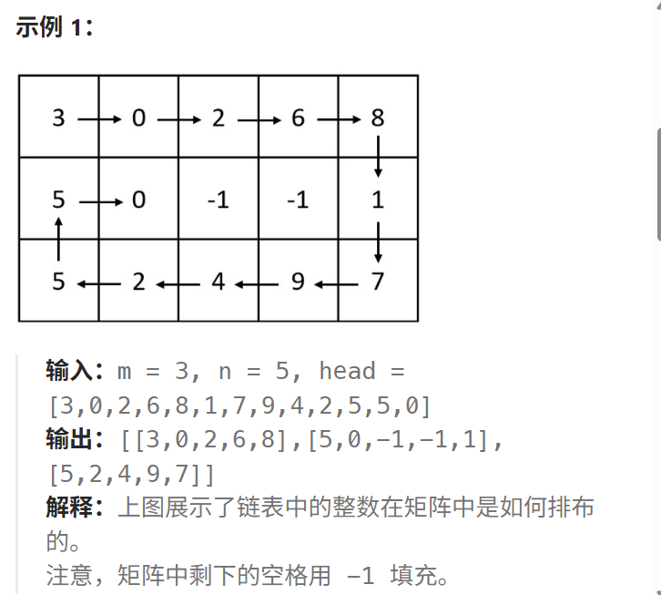
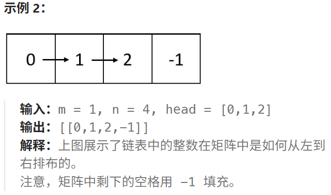
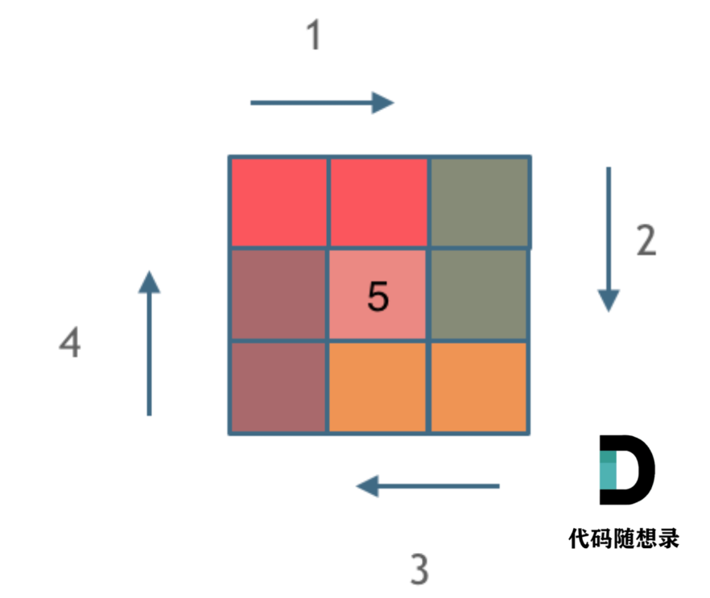

# 2326.螺旋矩阵4

## 2326.螺旋矩阵4

[力扣题目链接](https://leetcode.cn/problems/spiral-matrix-iv/)

给你两个整数：`m` 和 `n` ，表示矩阵的维数。

另给你一个整数链表的头节点 `head` 。

请你生成一个大小为 `m x n` 的螺旋矩阵，矩阵包含链表中的所有整数。链表中的整数从矩阵 **左上角** 开始、**顺时针** 按 **螺旋** 顺序填充。如果还存在剩余的空格，则用 `-1` 填充。

返回生成的矩阵。





**提示：**

- `1 <= m, n <= 105`
- `1 <= m * n <= 105`
- 链表中节点数目在范围 `[1, m * n]` 内
- `0 <= Node.val <= 1000`

## 算法思路

参考螺旋矩阵1和螺旋矩阵2

核心思路依旧是将矩阵看成若干层，首先输出最外层的元素，其次输出次外层的元素，直到输出最内层的元素。

**我们优先处理外围成圈的元素，中间的部分单独处理，分有中间部分，无中间部分的情况**

```
[[1, 1, 1, 1, 1, 1, 1],
 [1, 2, 2, 2, 2, 2, 1],
 [1, 2, 3, 3, 3, 2, 1],
 [1, 2, 2, 2, 2, 2, 1],
 [1, 1, 1, 1, 1, 1, 1]]
```

外围的圈想要写好关键是定义好遍历时每一轮循环的路径两端的开闭条件，这里采用**左闭右开**。

需要注意的是，内层的最后一个部分**必须**采用**左闭右闭**



### 实现

```java
/**
 * Definition for singly-linked list.
 * public class ListNode {
 *     int val;
 *     ListNode next;
 *     ListNode() {}
 *     ListNode(int val) { this.val = val; }
 *     ListNode(int val, ListNode next) { this.val = val; this.next = next; }
 * }
 */
class Solution {
    public int[][] spiralMatrix(int m, int n, ListNode head) {
        int[][] res = new int[m][n];
        for (int[] i : res) {
            Arrays.fill(i, -1);   // 将整行填为 -1
        }
        int row = 0,col = 0;
        int top = 0,bottom = m - 1,left = 0,right = n - 1;
        outer:
        while(top < bottom && left < right) {
            // 右
            for(col = left; col < right; col++) {
                res[top][col] = head.val;
                head = head.next;
                if (head == null) {
                    break outer;
                }
            }
            // 下
            for(row = top; row < bottom; row++) {
                res[row][right] = head.val;
                head = head.next;
                if (head == null) {
                    break outer;
                }
            }
            // 左
            for(col = right; col > left; col--) {
                res[bottom][col] = head.val;
                head = head.next;
                if (head == null) {
                    break outer;
                }
            }
            // 上
            for(row = bottom; row > top; row--) {
                res[row][left] = head.val;
                head = head.next;
                if (head == null) {
                    break outer;
                }
            }
            top++;bottom--;left++;right--;
        }
        // 注意单独填充时左闭右闭
        if(top == bottom) {
            for(col = left; col <= right; col++) {
                res[top][col] = head.val;
                head = head.next;
                if (head == null) {
                    break;
                }
            }
        } else if(left == right) {
            // 下
            for(row = top; row <= bottom; row++) {
                res[row][right] = head.val;
                head = head.next;
                if (head == null) {
                    break;
                }
            }
        }
        return res;
    }
}
```