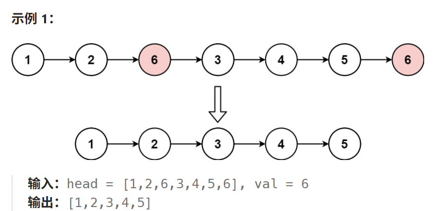
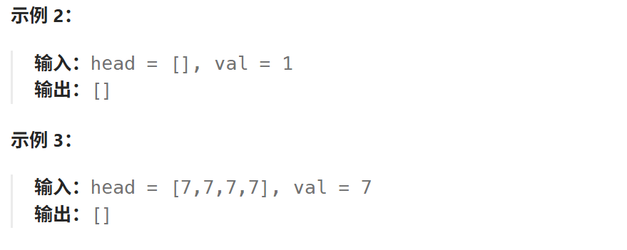

# 203.移除链表元素

## 203.移除链表元素

[力扣题目链接](https://leetcode.cn/problems/remove-linked-list-elements/description/)

给你一个链表的头节点 `head` 和一个整数 `val` ，请你删除链表中所有满足 `Node.val == val` 的节点，并返回 **新的头节点** 。





**提示：**

- 列表中的节点数目在范围 `[0, 104]` 内
- `1 <= Node.val <= 50`
- `0 <= val <= 50`

## 算法思路

可以定义一个虚拟指针，供给我们作为平台站上去，因为链表有个特点：

- 当站在当前位置上时，**只能删除当前位置后面的，不能删除当前位置前面的和它本身**

这意味着，不确认下个位置是安全的，我们绝对不能随便先站上去

**注意只有确认下一个为目标值才删除，非目标值才移动**

### 实现

```java
class Solution {
    public ListNode removeElements(ListNode head, int val) {
        ListNode dummy = new ListNode(0, head); // 定义一个指向头指针的虚拟节点
        ListNode current = dummy;
        while (current.next != null) { // 停止条件为直到找不到后续元素
            if (current.next.val == val) { //检查后续元素是否为目标值,为目标值就删除，删除后不移动,继续检查直到非目标值
                current.next = current.next.next; // 删除
            }else { // 只有非目标值时才移动
                current = current.next;
            }
        }
        return dummy.next;
    }
}
```